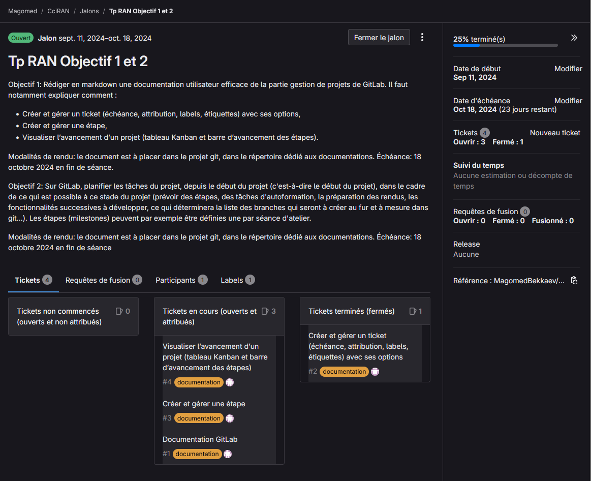
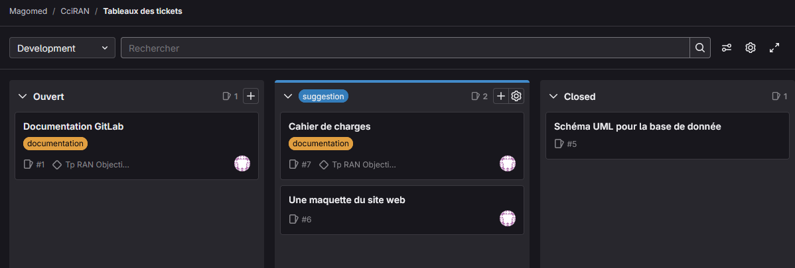

# **Documentation utilisateur GitLab**

## Gestion de projet GitLab

GitLab permet de gérer des projets de développement informatique (web, application, logiciel, etc.) aussi bien personnels qu’en équipe. GitLab propose différentes fonctionnalités de gestion, notamment :

- tickets (issues),
- attributions,
- labels,
- étiquettes,
- jalons (étape/milestones).

### Comment créer un projet GitLab

C'est simple : créez un compte utilisateur sur gitlab.com, allez dans la barre latérale gauche et cliquez sur "Projets". Ensuite, sur la page qui s'affiche, cliquez sur "Nouveau projet".

Vous devez maintenant choisir comment initier le projet. Vous pouvez créer un projet vide, partir d'un modèle, importer un projet ou configurer CI/CD pour un dépôt externe. Dans notre cas, nous allons créer un projet vide.

Vous arrivez sur la page de création du projet. Il faut définir :

- le nom du projet,
- l'URL du projet,
- le niveau de visibilité (privé, interne ou public).

Enfin, cliquez sur le bouton "Créer le projet", et voilà, vous pouvez commencer à gérer votre projet !

------

### **Tickets: comment créer et gérer:**

Un **ticket** (ou **issue**) sur GitLab est une tâche ou un problème à résoudre dans un projet. Il permet aux membres d'une équipe de collaborer en suivant les bogues, les nouvelles fonctionnalités ou les améliorations à apporter. Chaque ticket est généralement associé à une discussion, des assignations, des labels et un état (ouvert/fermé), facilitant la gestion du travail et le suivi de l'avancement du projet.

Pour créer un ticket il faut ouvrir votre projet, aller dans la rubrique "*Programmation*" dans **le menu à gauche**, appuyer sur "*Tickets*" puis "*Nouveau ticket*". Une fois sur la page de création du ticket, il faut définir son nom, son type (ticket simple ou incident), décrire le ticket, la ou les personnes assigné, le jalon et des labels et enfin appuyer sur le bouton "*Créer ticket*".

Pour trouver les ticket crée, il faut appuyer sur le bouton "*Tickets*" dans la barre latéral

Dans le menu de gestion d'un tickets nous pouvons voir son nom, son statuts, qui est quand l'a crée ainsi ça description. Nous avons aussi la possibilité de diviser le ticket en parties plus petites appelé "éléments enfant", relier les tickets entre eux pour mettre en évidence leur relation, voir la fil d'activité et laisser un commentaire.

------

### Un jalon: comment créer et gérer

Une **étape** (ou **milestone**) sur GitLab est un outil de gestion de projet qui permet de regrouper plusieurs tickets (issues) et merge requests (demandes de fusion) sous un même objectif ou échéance. Elle aide à planifier et suivre l’avancement d’un projet en définissant des périodes ou des jalons clés, permettant ainsi aux équipes de visualiser la progression vers un but commun, comme une version ou une livraison spécifique. Une étape peut être assignée à un projet ou à un groupe de projets.

La création d'un jalon est presque identique à celle d'un ticket : cliquez sur le bouton "*Jalon*" dans la barre latérale, puis sur "*Nouveau jalon*". Il faut définir son titre, sa date de début, sa date d'échéance ainsi que sa description.

Dans la fenêtre de gestion d'un jalon, nous pouvons voir le titre, la description et le statut. Nous pouvons également consulter les requêtes de fusion, les participants, les labels et les tickets associés à ce jalon. Dans la barre latérale droite, on peut aussi observer la barre de progression du jalon, sa date de début, sa date d'échéance et d'autres informations.

------

### Tableau de Kanban

Un **tableau Kanban** sur GitLab est un outil visuel de gestion de projet qui permet de suivre les tâches (issues) à travers différentes étapes de leur cycle de vie, sous forme de colonnes. Chaque colonne représente un état particulier (comme "À faire", "En cours", "Terminé"), et les tickets se déplacent d'une colonne à l'autre à mesure qu'ils progressent. Cela aide les équipes à mieux organiser leur flux de travail, à identifier les blocages et à améliorer la productivité en limitant les tâches en cours et en favorisant un flux continu de travail.

